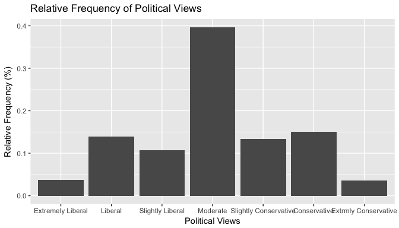
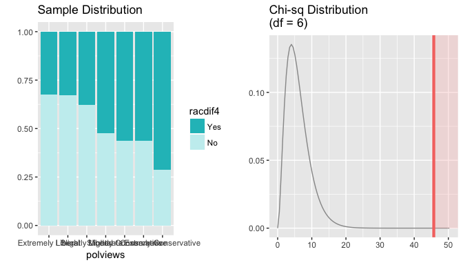

# Statistical inference with the GSS data

## Setup

### Load packages


```r
library(ggplot2)
```

```
## Warning: package 'ggplot2' was built under R version 3.2.5
```

```r
library(dplyr)
```

```
## Warning: package 'dplyr' was built under R version 3.2.5
```

```r
library(statsr)
```

### Load data


```r
load("gss.Rdata")
```


* * *

## Part 1: Data
The observations in the GSS dataset are collected through personal-interview surveys. The data that we are examining in this project
are from 1972 through 2012. Since this was an observational study and not an experiment, we can not determine causation for any research
questions that we may explore. In addition, random assignment was not used either. Nevertheless, the participants for these surveys were determined randomly (random sampling), and there are a substantial amount of responses.These two conditions will allow us to generalize our findings.

* * *

## Part 2: Research question
**Research question 1: ** Do people who have different political beliefs share the different opinion as it relates to the question of 
"Do most African Americans have worse jobs, income, and housing than white people because they just don't have the motivation or willpower to pull themselves up out of poverty?"

**Reason of Interest: ** This particular question is interesting to me because I would like to determine if there is any difference
between those who consider themselves liberal and those who consider themselves to be conservative. As a black male,
I am acutely aware of the many reasons that black people are in their respective conditions. I would rank lack of education and institutional 
discrimination as the the highest. Nevertheless, I would like to see what other people think.


* * *

## Part 3: Exploratory data analysis
Since we are trying to determine where people stand on the willpower issue in accordance to their political views we filter out those 
who don't identify their political views or didn't answer 'yes' or 'no' to the question. In addition, we want to look at the latest
year that we have available.


```r
gss_modified <- gss %>%
    filter(!is.na(polviews), !is.na(racdif4), year==2012)
```

Before we seperate individuals by their political beliefs, I would like to see what average person thinks in regards to question above.


```r
gss_modified %>%
  summarise(yes_lack_of_will_perc = sum(racdif4=="Yes")/n(),
            yes_lack_of_will_num = sum(racdif4=="Yes"),
            no_lack_of_will_perc = sum(racdif4=="No")/n(),
            no_lack_of_will_num = sum(racdif4=="No"),
            total = n())
```

```
##   yes_lack_of_will_perc yes_lack_of_will_num no_lack_of_will_perc
## 1             0.4919423                  580            0.5080577
##   no_lack_of_will_num total
## 1                 599  1179
```
I'm happy to see that the approximately 51% of people think that most black people aren't in their situation just because they lack 
willpower or motivation. Before we begin analysing people's reponses by political beliefs we should also just see the makeup of our respondents as it relates to their views.


```r
gss_modified %>%
  group_by(polviews) %>%
  summarise(num_respondents = n())
```

```
## # A tibble: 7 × 2
##                polviews num_respondents
##                  <fctr>           <int>
## 1     Extremely Liberal              43
## 2               Liberal             164
## 3      Slightly Liberal             127
## 4              Moderate             467
## 5 Slightly Conservative             158
## 6          Conservative             178
## 7  Extrmly Conservative              42
```

As you can see in the bar plot below and the summary above the greatest percentag of respondents identify as moderate with the two lowest percentages of people identifying as extremely liberal or extremely conervative.


```r
ggplot(data = gss_modified, aes(x=polviews), fill=polviews) + 
  geom_bar(aes(y= (..count..)/ sum(..count..))) + 
  labs(x = "Political Views", y= "Relative Frequency (%)", title="Relative Frequency of Political Views")
```

<!-- -->

Okay, now that we understand the frequency of political views of our respondents and what the average person believes as it relates to why black people are doing worse than white people in the areas described, let's see where people stand on the issue when it comes to their political beliefs.


```r
gss_modified %>%
  group_by(polviews) %>%
  summarize(yes_lack_of_will_perc = sum(racdif4=="Yes")/n(),
            yes_lack_of_will_num = sum(racdif4=="Yes"),
            no_lack_of_will_perc = sum(racdif4=="No")/n(),
            no_lack_of_will_num = sum(racdif4=="No")
            )
```

```
## # A tibble: 7 × 5
##                polviews yes_lack_of_will_perc yes_lack_of_will_num
##                  <fctr>                 <dbl>                <int>
## 1     Extremely Liberal             0.3255814                   14
## 2               Liberal             0.3292683                   54
## 3      Slightly Liberal             0.3779528                   48
## 4              Moderate             0.5246253                  245
## 5 Slightly Conservative             0.5632911                   89
## 6          Conservative             0.5617978                  100
## 7  Extrmly Conservative             0.7142857                   30
## # ... with 2 more variables: no_lack_of_will_perc <dbl>,
## #   no_lack_of_will_num <int>
```

So we see that the more an individual identifies as conservative the more likely they are to believe that black people are doing worse because of their lack of willpower or motivation. The interesting here is that the percentages for those who consider themselves liberal are relatively close to each other while there's approximately a 15% difference when it comes to conservatives and those who identify as extremely conservative. Also, there is approximately a 18.38% difference between those who are slightly liberal and slightly conservative. Even though we are unable to quantify what those to terms mean, one would think that ideologically there isn't much of a difference. So we see that there are some big differences but are they significant?

* * *

## Part 4: Inference
We are ultimately trying to determine if people will respond similarly to the question concerning african americans and will power despite their race.
The hypotheses are as follows:
 <ul>
 <li> <b>HO:</b> People will respond similarly to to the question concerning black people have worse jobs, income, and housing because of the lack of will power despite their political beliefs. And any difference that we observe is just due to chance.</li>
 <li><strong>HA:</strong> People will respond differently to the question depending on their political beliefs. </li>
 </ul>
 
 The two condition for the chi-square test involve indepdence and sample size. We assume that each survey respondent's observations are independent of each other; however, if someone knew another individual who took the survey what they put for particular questions then that
assumption could be affected. In the last table, we showed that there are more than 5 occurrences for each of the possible responses for each of the political beliefs. With the sample size condition met, we can use the theoretical method.

The reason I'm using a chi-squared test is because the research question requires an analysis of two proportions for categorical data with mor than two levels. Also, since I'm performig a chi-squared hypothesis test, a confidence interval will not be calculated.  


```r
inference(y = racdif4, x = polviews, data = gss_modified, type = "ht", statistic = "proportion", success = "Yes", method = "theoretical", alternative = "greater")
```

```
## Response variable: categorical (2 levels) 
## Explanatory variable: categorical (7 levels) 
## Observed:
##                        y
## x                       Yes  No
##   Extremely Liberal      14  29
##   Liberal                54 110
##   Slightly Liberal       48  79
##   Moderate              245 222
##   Slightly Conservative  89  69
##   Conservative          100  78
##   Extrmly Conservative   30  12
## 
## Expected:
##                        y
## x                             Yes        No
##   Extremely Liberal      21.15352  21.84648
##   Liberal                80.67854  83.32146
##   Slightly Liberal       62.47668  64.52332
##   Moderate              229.73707 237.26293
##   Slightly Conservative  77.72689  80.27311
##   Conservative           87.56573  90.43427
##   Extrmly Conservative   20.66158  21.33842
## 
## H0: polviews and racdif4 are independent
## HA: polviews and racdif4 are dependent
## chi_sq = 45.7249, df = 6, p_value = 0
```

<!-- -->


The data table above shows what we observed in relation to the question and a respondent's political beliefs and what we would expect the response rates to be if they were independent. In the exploratory analysis section, we determined that on average people responded yes 51% of the time  and no 49%. With a chi-square value of 45.7249, our **p value** is approximately zero. The p value being zero helps us conclude that it is highly unlikely (0% chance) that we would observe reponses as we have if the null hypothesis was true. Therefore, we **reject the null hypothesis** that responses to the question concerning "Do you think these differences are: d. Because most (negroes/blacks/African-Americans) just don't have the motivation or willpower to pull themselves up out of poverty?" are independent of political belief.

This exploration was particularly enlightening that the majority of conservatives believe that black people are worse off because of a lack of "willpower or motivation." While I didn't explore if these differences are an improvement over years past, I would hope that we've made some improvements.

If I were to continue exploring the data and how things impact responses to the central question, I would start exploring how a respondent's education, income or race would impact their answers. Additionally, I would try to see how the combination of one the suggestions I mentioned and their political belief would affect one's answer. 
