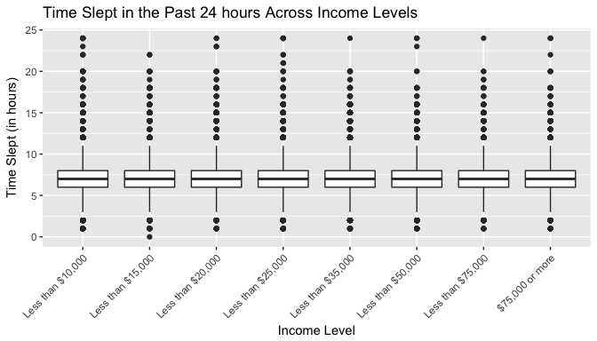
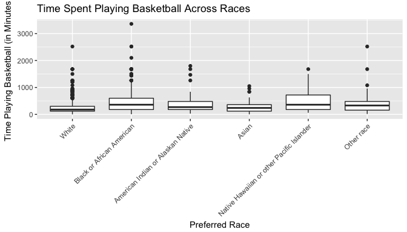
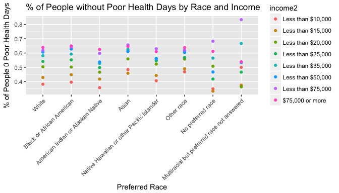

# Exploring the BRFSS data

## Setup

### Load packages


```r
library(ggplot2)
```

```
## Warning: package 'ggplot2' was built under R version 3.2.5
```

```r
library(dplyr)
```

```
## Warning: package 'dplyr' was built under R version 3.2.5
```

### Load data

Make sure your data and R Markdown files are in the same directory. When loaded
your data file will be called `brfss2013`. Delete this note when before you submit 
your work. 


```r
load("brfss2013.RData")
```


* * *

## Part 1: Data
The BRFSS data that is compromised of responses of almost 500,000 people across each of 50 states and US territories is generalizable because of the sample size and the way in which individuals were selected (randomly). However because this was an observational study, the results can not be used to determine causation. 

* * *

## Part 2: Research questions

**Research quesion 1:** How does income level affect time spent sleeping? Specifically, are people who make more money more likely to sleep less than those who make less money? 

* **Associated Variables:** How Much Time Do You Sleep and Income Level
* **Interest:** I believe there may be some misconceptions surrounding how much people make and how much sleep they get on a regular basis. I would like to see if people who earn more actually sleep less.

**Research quesion 2:** Do people who identify as black play more basketball on average than people of other races.

* **Associated Variables:** Preferred Race, primary physical activity, times per week spent taking part in a particular activity, and time Spent performing primary physical activity. 
* **Interest:** The majority of NBA players would identify as black, but I wonder if black people as a whole are playing more basketball than others.

**Research quesion 3:** How does physical and mental health look among income level and race?

* **Associated Variables:** Race, Income Level, Number of Days Mental Health Not Good
* **Interest:** The Notorious B.I.G once said, "Mo Money Mo Problems." While I don't intend to make light of the mental health challenges faced by tens of thousands of Americans, I do believe that Biggie's statement is true and would like to see how this relates to mental health in the BRFSS data set.

* * *

## Part 3: Exploratory data analysis

NOTE: Insert code chunks as needed by clicking on the "Insert a new code chunk" 
button (green button with orange arrow) above. Make sure that your code is visible
in the project you submit. Delete this note when before you submit your work.

**Research quesion 1:**
Remember we are interested in understanding how the amount of sleep differs between income levels. Therefore, the particular columns we are interested in investigating are income2 and sleptim1.

From the cookbook, we see that we have over 490k responses, but we need to group those responses by income level and filter out that are NA for income2 and sleptim1. 


```r
brfss2013 %>%
  filter(!is.na(income2), !is.na(sleptim1)) %>%
  group_by(income2) %>%
  summarise(avg_sleptime_minutes = mean(sleptim1) * 60) %>%
  arrange(desc(avg_sleptime_minutes))
```

```
## # A tibble: 8 × 2
##             income2 avg_sleptime_minutes
##              <fctr>                <dbl>
## 1 Less than $35,000             424.4199
## 2 Less than $50,000             424.2130
## 3 Less than $75,000             422.8560
## 4   $75,000 or more             422.7356
## 5 Less than $25,000             422.3950
## 6 Less than $20,000             421.7100
## 7 Less than $15,000             416.7786
## 8 Less than $10,000             411.8212
```

I've put the mean sleep time in minutes in order to see the difference more clearly. From a first glance there looks to be subtle differences between the amount of time slept by those with lower incomes and those who make more money. It seems as people who make between 25k and 34,999 get the most sleep. However, after the bracket 'Less than $15000' the mean time slept is only separted by approximatley two minutes. But we know that the mean can be skewed by outliers so let's use a boxplot to take a closer look.


```r
brfss2013 %>%
  filter(!is.na(income2) & !is.na(sleptim1)) %>%
  ggplot(mapping=aes(x=income2, y=sleptim1)) + geom_boxplot() + theme(axis.text.x = element_text(angle = 45, vjust = 1, hjust=1)) + xlab("Income Level") + ylab("Time Slept (in hours)") + ggtitle("Time Slept in the Past 24 hours Across Income Levels")
```

<!-- -->
 The box plot shows that the medians (7 hours) are equal regardless of the income level and that there are a good amount of outliers in each of the income brackets. This should have been expected because approximately 79% of participants said they slept 6, 7 or 8 hours in a 24 hour period.Thus our best way of determining the answer to the question is by relying on the mean.

**Research quesion 2:**
We want to see what race is playing basketball the most. The way we are going to answer this question is by looking at people whose primary source of physical activity comes from basketball. Therefore, we need to look at the following variables: preferred race, exercise in past 30 days, type of physical activity, other type of physical activity, and how often they spent doing the activity which in this case would be basketball.

Let's start by seeing just how many people have their primary or secondary physical activity as basketball.

```r
brfss2013 %>%
  filter(!is.na(X_prace1), exerany2=='Yes', exract11=='Basketball') %>%
  group_by(X_prace1) %>%
  summarise(count=n())
```

```
## # A tibble: 8 × 2
##                                      X_prace1 count
##                                        <fctr> <int>
## 1                                       White  1365
## 2                   Black or African American   459
## 3           American Indian or Alaskan Native    92
## 4                                       Asian   112
## 5   Native Hawaiian or other Pacific Islander    49
## 6                                  Other race   107
## 7                           No preferred race    11
## 8 Multiracial but preferred race not answered     2
```
We need to be able to find the sum of the time spent playing basketball whether it is a person's primary or secondar physical activity. I believe the best way to do that is to multiply the exhermm1 by exeroft1. Let's start by making a column denoting if the times per week is available.

```r
brfss2013<- brfss2013 %>%
  # seeing if they reported number of times they perform a physical activity in a week
  mutate(exerhmm1_week_av = ifelse(exeroft1 >= 101 & exeroft1 <= 199, 'yes', 'no'))
```

One of the issues is tht exhermm1 is not in a format were we can easily multiply by exeroft1. Let's seperate the hours and minutes.

```r
brfss2013<- brfss2013 %>%
  # seperating minutes and hours
  mutate(exermm1 = exerhmm1 %% 100,
         exerh1 = floor(exerhmm1/100))
```


Now, we can do our multiplication and then see what the time spent playing basketball is.

```r
brfss2013<- brfss2013 %>%
  # time spent performing primary physical activity
  mutate(exerhmm1_week = ifelse(exerhmm1_week_av == 'yes', ((exeroft1-100) * (exermm1 + exerh1*60)), NA))
```

With the new columns, we can now report on the summary statistics.


```r
#summary statistics of time spent playing basketball
brfss2013 %>%
  filter(!is.na(X_prace1), exerhmm1_week != 'NA', exerany2=='Yes', exract11=='Basketball', exerhmm1_week_av=='yes') %>%
  group_by(X_prace1) %>%
  summarise(avg_time_spent_basketball = sum(exerhmm1_week)/n(), median = median(exerhmm1_week), count=n()) %>%
  arrange(desc(avg_time_spent_basketball))
```

```
## # A tibble: 8 × 4
##                                      X_prace1 avg_time_spent_basketball
##                                        <fctr>                     <dbl>
## 1 Multiracial but preferred race not answered                  840.0000
## 2   Native Hawaiian or other Pacific Islander                  528.2812
## 3                   Black or African American                  470.3367
## 4                           No preferred race                  469.3750
## 5           American Indian or Alaskan Native                  405.3774
## 6                                  Other race                  389.4231
## 7                                       Asian                  266.9012
## 8                                       White                  243.2610
## # ... with 2 more variables: median <dbl>, count <int>
```

It looks like we have a very small number of people who identified as multiracial and 'no preferred race' who had a primary physical activity of basketball. Let's take a look when we don't include them.


```r
brfss2013 %>%
  filter(!is.na(X_prace1), exerhmm1_week != 'NA', exerany2=='Yes', exract11=='Basketball', exerhmm1_week_av=='yes', X_prace1 != 'Multiracial but preferred race not answered', X_prace1 != 'No preferred race') %>%
  group_by(X_prace1) %>%
  summarise(avg_time_spent_basketball = sum(exerhmm1_week)/n(), median = median(exerhmm1_week), count=n()) %>%
  arrange(desc(avg_time_spent_basketball))
```

```
## # A tibble: 6 × 4
##                                    X_prace1 avg_time_spent_basketball
##                                      <fctr>                     <dbl>
## 1 Native Hawaiian or other Pacific Islander                  528.2812
## 2                 Black or African American                  470.3367
## 3         American Indian or Alaskan Native                  405.3774
## 4                                Other race                  389.4231
## 5                                     Asian                  266.9012
## 6                                     White                  243.2610
## # ... with 2 more variables: median <dbl>, count <int>
```
If we want to use the mean, people who identify as Native Hawaiian or other Pacific Islander spend the most time playing basketball. But since the average is susceptible to being moved by outliers and the amount of people who had a primary physical activity as basketball and identified as Native Hawaiian or other Pacific Islander is so small I believe the median is the better measurement. Thus it would seem that people who identify as 'Native Hawaiian or other Pacific Islander' or 'Black or African American' spend the most time playing basketball.


```r
brfss2013 %>%
  filter(!is.na(X_prace1), exerhmm1_week != 'NA', exerany2=='Yes', exract11=='Basketball', exerhmm1_week_av=='yes', X_prace1 != 'Multiracial but preferred race not answered', X_prace1 != 'No preferred race') %>%
  ggplot(mapping=aes(x=X_prace1, y=exerhmm1_week)) + geom_boxplot() + theme( axis.text.x = element_text(angle = 45, vjust = 1, hjust=1)) + xlab("Preferred Race") + ylab("Time Playing Basketball (in Minutes)") + ggtitle("Time Spent Playing Basketball Across Races")
```

<!-- -->

The boxplot above shows that there are a lot of extreme values when it comes to the group of people who identify as Black or African American. As we expected this skews the mean. Neverthless, the plot above shows that the median for time spent playing basketball is equal for Blacks and Pacific Islanders.


**Research quesion 3:**
We want to see how the poor physical or mental health differs among people of various races and incomes. So the variables we will investigate are preferred race (X_prace1), income (income2), and poor physical or mental health.


```r
brfss2013 %>%
  filter(!is.na(X_prace1),!is.na(poorhlth)) %>%
  group_by(X_prace1) %>%
  summarise(avg_days_poor_health=mean(poorhlth), med_days_poor_health=median(poorhlth) , none_days=sum(poorhlth==0)/n(), count=n())
```

```
## # A tibble: 8 × 5
##                                      X_prace1 avg_days_poor_health
##                                        <fctr>                <dbl>
## 1                                       White             5.152804
## 2                   Black or African American             6.061384
## 3           American Indian or Alaskan Native             7.329929
## 4                                       Asian             3.275799
## 5   Native Hawaiian or other Pacific Islander             4.809912
## 6                                  Other race             5.583585
## 7                           No preferred race             6.399068
## 8 Multiracial but preferred race not answered             6.611111
## # ... with 3 more variables: med_days_poor_health <dbl>, none_days <dbl>,
## #   count <int>
```
When we look at the median number of days that people have poor physical or mental health across each of the different races it is 0 with the exception of people who identify as 'American Indian or Alaskan Native'. That's to be expected with almost half of the responses for each race being 0 or none. When we look at the mean, people who identify as 'American Indian or Alaskan Native' have more days of poor physical or mental health as well. It also looks like people who identify as Asian are less likely to experience any days of poor mental or physical health.  


```r
brfss2013 %>%
  filter(!is.na(income2),!is.na(poorhlth)) %>%
  group_by(income2) %>%
  summarise(avg_days_poor_health=mean(poorhlth), med_days_poor_health=median(poorhlth) , none_days=sum(poorhlth==0)/n(), count=n())
```

```
## # A tibble: 8 × 5
##             income2 avg_days_poor_health med_days_poor_health none_days
##              <fctr>                <dbl>                <dbl>     <dbl>
## 1 Less than $10,000            10.391383                    4 0.3895244
## 2 Less than $15,000             9.282774                    3 0.4353151
## 3 Less than $20,000             7.218180                    0 0.5063206
## 4 Less than $25,000             6.217850                    0 0.5422442
## 5 Less than $35,000             5.066216                    0 0.5821648
## 6 Less than $50,000             4.107824                    0 0.6063908
## 7 Less than $75,000             3.404083                    0 0.6208592
## 8   $75,000 or more             2.632917                    0 0.6390155
## # ... with 1 more variables: count <int>
```

When we look at physical and mental health across income brackets that changes. It looks like people with less money experience more days of poor mental or physical health. In addition, the more money an individual makes the more likely the are to experience no days of poor physical or mental health. 


```r
# putting summary stats in a new data frame
health_summary<-brfss2013 %>%
  filter(!is.na(X_prace1), !is.na(income2),!is.na(poorhlth)) %>%
  group_by(X_prace1, income2) %>%
  summarise(avg_days_poor_health=mean(poorhlth), med_days_poor_health=median(poorhlth) , none_days=sum(poorhlth==0)/n(), count=n())

# plot
ggplot(data = health_summary, aes(x=X_prace1, y=none_days)) + geom_point(aes(colour=income2)) + theme( axis.text.x = element_text(angle = 45, vjust = 1, hjust=1)) + xlab("Preferred Race") + ylab("% of People 0 Poor Health Days") + ggtitle("% of People without Poor Health Days by Race and Income")
```

<!-- -->

If we look at the percentage of people who experienced zero days of poor mental or physical health, people who identfy as 'Multiracial but preferred race not answered' and make between $50k and $75k are more likely to have zero days of poor mental or physical health. However, there is one individual that had 30 days of poor physical or mental health. Like it was revealed earlier income and days of poor mental or physical health are negatively correlated. This holds despite of race. 
